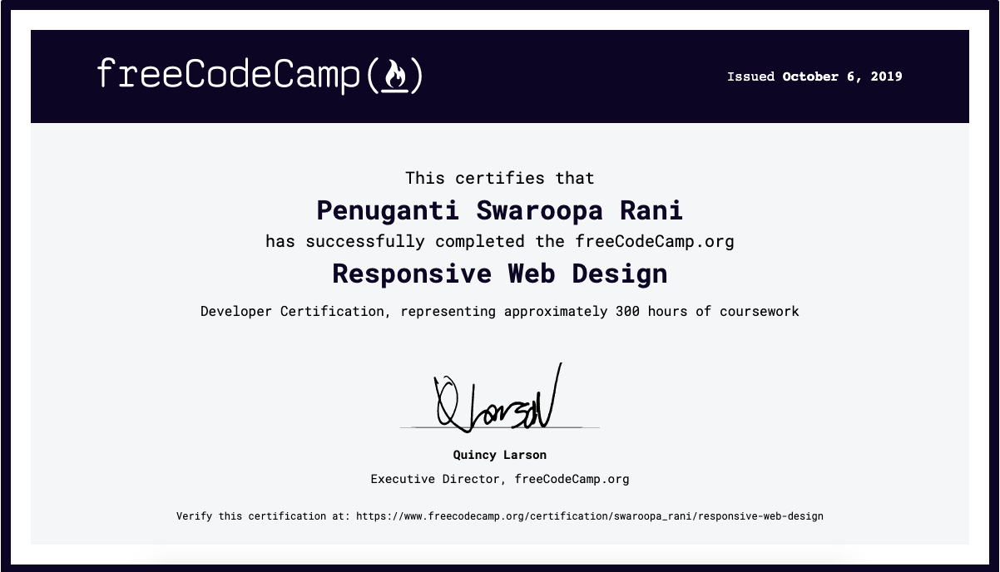

# Responsive Web Design Certification: projects

These projects were written as a part of responsive web design certification.

Navigate to respective project folders to find user stories full filled as part of the project and for information of how the stories are tested.

This CDN link has been used to run the tests for verifying user stories in each problem statement: https://cdn.freecodecamp.org/testable-projects-fcc/v1/bundle.js

Find below the certificate earned from FreeCodeCamp.

Verify this certification at: https://www.freecodecamp.org/certification/swaroopa_rani/responsive-web-design

